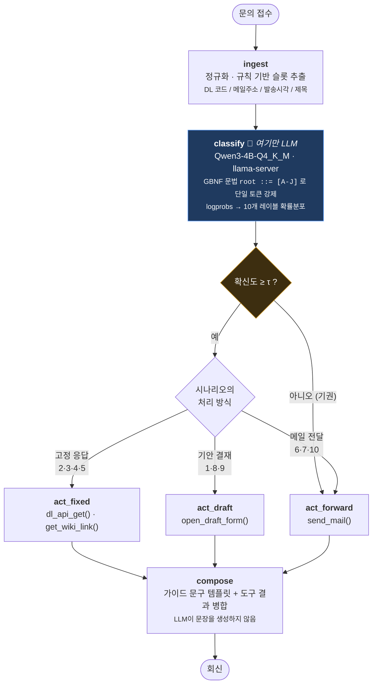

# 시스템 구성

## 1. 이 에이전트가 하는 일

사내 메일링그룹(DL) 담당자에게 들어오는 문의를 받아 **10개 시나리오 중 하나로 분류**하고,
시나리오에 정해진 **처리 액션을 대신 수행**한다. 액션은 세 가지다.

| 처리 방식 | 시나리오 | 하는 일 |
|---|---|---|
| 고정 응답 | 2, 3, 4, 5 | 가이드에 적힌 안내문을 회신. 필요하면 DL API로 설정을 조회해 안내에 반영 |
| 기안 결재 | 1, 8, 9 | 사내정보시스템 기안 서식을 열고, 기재해야 할 항목을 채워 안내 |
| 메일 전달 | 6, 7, 10 | DL 시스템 관리자 또는  메일 CS에게 문의를 전달 |

도구는 **전부 스텁(모의 호출)** 이라 실제 부작용이 없다. 호출 사실과 인자는
`results/tool_audit.log` 에 JSON Lines로 남는다.

## 2. 그래프 구조



노드는 `src/dl_agent/graph.py` 에 1:1로 대응한다.

## 3. 설계에서 의도적으로 정한 것

### 3.1 경량 LLM의 역할을 분류 한 가지로 좁혔다

4B 양자화 모델은 한국어 사내 문의를 **읽고 갈래를 나누는 데는 충분**하지만,
링크·메일주소·정책 문장을 정확히 **생성**하는 데는 부족하다. 그래서 파이프라인에서
LLM이 관여하는 지점은 `classify` 노드 하나뿐이다.

| 일 | 담당 | 이유 |
|---|---|---|
| 시나리오 분류 | Qwen3-4B | 문장의 의도 파악은 규칙으로 잘 안 됨 |
| DL 코드·메일주소·시각 추출 | 정규식 | 결정 가능한 값. 토큰 단위 실수를 원천 차단 |
| 도구 선택·인자 구성 | 시나리오→액션 매핑 표 | 분류만 맞으면 100% 정확 |
| 응답 문장 | 가이드 문구 템플릿 | 링크/정책 hallucination 불가능 |

그 결과 **분류 정확도가 그대로 시스템 성능의 상한**이 된다. 평가에서 분류 정확도와
End-to-End 성공률이 거의 같은 값으로 나오는 이유가 이것이다.

### 3.2 분류를 "생성"이 아니라 "단일 토큰 선택"으로 바꿨다

시나리오 10개에 `A`~`J` 한 글자 레이블을 붙이고, llama-server에 GBNF 문법
`root ::= [A-J]` 을 넘겨 **출력 어휘 자체를 10글자로 제한**했다.

얻는 것:

1. **파싱 실패율이 구조적으로 0.** JSON을 뱉게 하고 정규식으로 긁는 방식은 소형 모델에서
   포맷 붕괴가 나지만, 문법 강제에서는 문법에 맞지 않는 토큰이 샘플링 단계에서 제거된다.
2. **진짜 확률분포를 얻는다.** `logprobs`/`top_logprobs` 로 그 한 토큰의 후보 분포를 받아
   A~J 위에서 재정규화하면 10개 시나리오에 대한 사후확률이 된다.
   모델에게 "확신도를 숫자로 말해봐"라고 묻는 것(자기보고)과 달리 실제 디코딩 분포다.
3. **생성 토큰이 1개**라 지연시간이 프롬프트 처리에 거의 수렴한다.

Qwen3는 기본이 thinking 모드라 첫 토큰이 `<think>` 가 되어 문법과 충돌한다.
`chat_template_kwargs.enable_thinking=false` 와 `/no_think` 소프트 스위치를 함께 걸어 껐다.

### 3.3 확신이 없으면 자동 처리하지 않는다 (기권)

`confidence < τ` 이면 예측을 버리고 시나리오 10(관리자 전달)로 보낸다.
헬프데스크에서 **틀린 안내를 자동 발송하는 비용**이 사람에게 넘기는 비용보다 크기 때문이다.
τ는 검증셋에서 고르고, 테스트셋에서는 고정한 채로만 쓴다.
효과는 `docs/evaluation.md` 의 risk–coverage 곡선으로 측정한다.

## 4. 모듈 배치

```
src/dl_agent/
  schema.py     10개 시나리오 정의, 액션 매핑, 레이블(A~J), 그래프 상태 타입
  config.py     환경변수 설정 (백엔드 URL, few-shot k, 기권 임계값 …)
  llm.py        llama-server OpenAI 호환 클라이언트 — 문법 강제 + logprobs 재정규화
  prompts.py    프롬프트 v0/v1/v2, train 스플릿 전용 few-shot 로더
  extract.py    정규식 슬롯 추출
  tools.py      스텁 도구 4종 + 감사 로그
  responses.py  시나리오별 응답 템플릿
  graph.py      LangGraph 조립
  server.py     FastAPI (`/api/chat` 은 응답과 함께 판단 근거를 반환)
  web/index.html  웹 채팅 UI — 좌측 대화, 우측 확률분포·슬롯·도구호출·실행경로

benchmark/
  data/pool.jsonl   손으로 작성한 200문항
  split.py          시나리오×난이도 이중 층화 분할
  metrics.py        지표 구현 (외부 라이브러리 없음)
  baselines.py      규칙 기반 베이스라인 + 동일 그래프에 꽂는 어댑터
  run_eval.py       그래프 전체를 돌려 채점
  compare.py        결과 비교표
```

## 5. 스텁 도구 스펙

| 도구 | 인자 | 반환 | 호출 시나리오 |
|---|---|---|---|
| `open_draft_form` | `request_type`, `prefill` | 기안 URL, 필수 기재 항목, 접수번호 | 1 → `dl_rename`, 8 → `dynamic_dl`, 9 → `dl_api_acl` |
| `send_mail` | `to`, `subject`, `body` | 메시지 ID, 큐 시각 | 6·10 → 관리자, 7 →  CS |
| `dl_api_get` | `dl_code` | 외부메일 수신 설정, 멤버 수, 상태 | 4 (문의에 DL 코드가 있을 때만) |
| `get_wiki_link` | `topic` | 위키 제목·URL | 5 → 발송권한 가이드, 9 → REST API |

`dl_api_get` 은 DL 코드를 시드로 응답을 만들어 **같은 코드는 항상 같은 결과**를 준다.
평가를 여러 번 돌려도 도구 결과가 흔들리지 않게 하기 위한 것이다.

## 6. 실행 흐름 예시

입력: `"DL345678 로 외부 메일이 안 들어옵니다."`

```
ingest    슬롯 dl_codes=['DL345678']
classify  D(1.00) → 시나리오 4 [371ms]
act_fixed dl_api_get(DL345678) → external_mail_receive=ALLOW
compose   "[외부메일 수신] 값이 허용인지 확인해 주세요" + 조회 결과(허용/ACTIVE/50명) 인용
          + "허용인데도 안 되면 발신제한 가능성" 안내 + 미확보 정보 목록
```

`dl_api_get` 이 `DENY` 를 돌려주면 응답이 갈라진다 — 원인이 특정됐으므로
관리자 문의 안내 대신 "외부메일 수신을 `허용`으로 바꾸세요"만 나간다
(`src/dl_agent/responses.py`).

분류가 4로 떨어졌고 문의에 DL 코드가 있으므로 조회 도구가 붙는다. 코드가 없으면
같은 시나리오라도 도구 없이 안내문만 나간다 — 평가의 기대 도구 집합도 이 조건을 그대로 반영한다.
